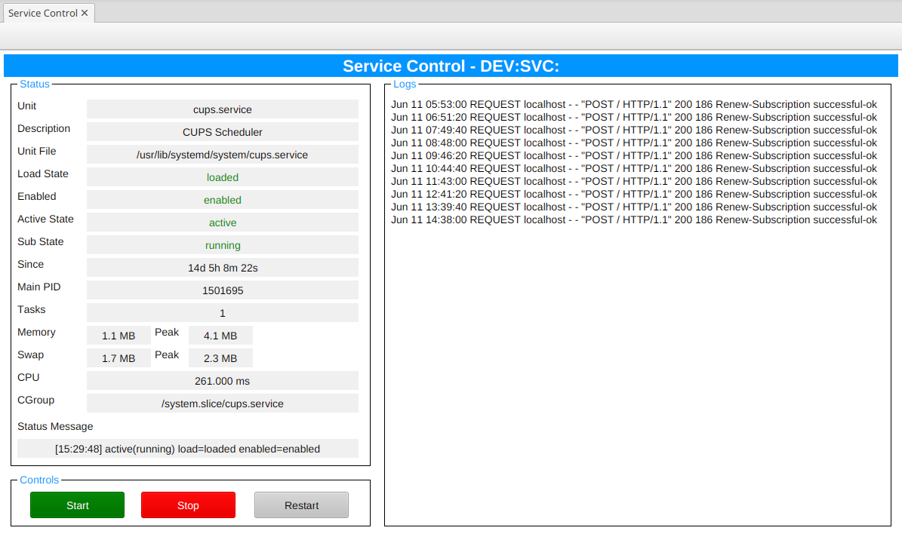

# remote-svc-ctrl [](https://github.com/NSLS2/remote-svc-ctrl/actions/workflows/ci.yml)

An EPICS IOC that monitors and controls systemd services, exposing their status as Process Variables (PVs). Supports both local and remote (via SSH) service management.

This can be particularly useful for managing acquisition/control services on vendor provided systems, such as the Dectris `camserver` service for Pilatus3 detectors, or the `xspd` remote control service from X-Spectrum.

## Features

- Poll `systemctl status` and publish service state as EPICS PVs
- Start, stop, and restart services via Channel Access
- Monitor over SSH for services running on remote hosts
- Phoebus operator screen included

## Usage

```bash
# Monitor a local service
remote-svc-ctrl "XF:28ID-CT{Svc:MyApp}" my-app.service

# Monitor a service on a remote host via SSH
remote-svc-ctrl "XF:28ID-CT{Svc:MyApp}" my-app.service --host user@server
```

## Operator Screen

A Phoebus `.bob` screen is provided in [`op/service_ctrl.bob`](op/service_ctrl.bob). Open it with the macro `PREFIX` set to your IOC's PV prefix.



## Documentation

- [PV Reference](docs/pvs.md) — full list of exposed PVs and their behavior
- [Polkit Configuration](docs/polkit.md) — allow non-root service control without a password
- [SSH Key Setup](docs/ssh-setup.md) — configure passwordless SSH for remote host management

## Development

```bash
uv sync                             # Install dependencies
uv run pytest                       # Unit tests
uv run pre-commit run --all-files   # Linting and formatting
```

## Requirements

- Python >= 3.11
- [pythonSoftIOC](https://github.com/dls-controls/pythonSoftIOC) >= 4.7.0
- `systemctl` available on the target host
- For non-root service control: appropriate polkit rules configured on the target host
- SSH key-based auth configured for remote hosts
